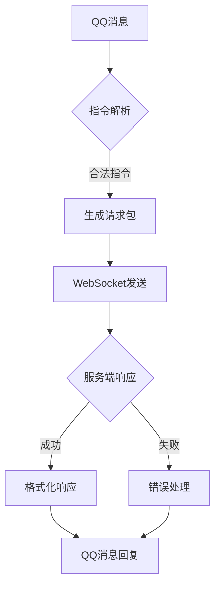

# GO-MCQQBotClient (HuHoBot Main Bot Client in Go)

[](https://golang.org/)
[](https://opensource.org/licenses/GPL-3.0)

迁移自 [HuHoBot/BotClient](https://github.com/HuHoBot/BotClient) 的Go语言实现版本，基于QQ官方Bot框架的Minecraft服务管理机器人。

## 核心能力

### 功能特性
- **双向通信**：通过WebSocket与服务端保持长连接
- **权限管理**：多层级管理员系统  
- **高性能**：基于Go的并发模型
- **配置驱动**：YAML格式配置文件
- **模块化设计**：清晰的代码组织结构

### 主要功能
- 白名单添加/删除/查询
- 服务器状态监控  
- 游戏内命令执行
- MOTD服务器状态查询
- 服务器绑定管理
- 自定义扩展指令

## 技术架构



## 快速入门

### 环境要求
- Go 1.20+
- SQLite3 (嵌入式数据库)
- QQ开放平台应用

### 安装运行
```bash
# 克隆仓库
git clone https://github.com/ChuranNeko/GO-MCQQBotClient.git

# 进入项目目录
cd GO-MCQQBotClient

# 构建并运行
go build -o bot cmd/bot/main.go
./bot
```

## 配置说明

### 核心配置 (config.yaml)
```yaml
appid: ""        # QQ机器人应用ID
secret: ""       # QQ机器人应用密钥
audit: true      # 审核模式
sandbox: false   # 沙盒模式
```

### 功能特性
- 自动心跳检测（5秒间隔）
- 断线自动重连（3秒重试）  
- 请求超时自动清理
- 完善的日志系统

## 迁移说明
此版本是从Python迁移到Go的重构实现，主要改进：
1. 性能提升：利用Go的并发模型处理更高吞吐量
2. 稳定性增强：更健壮的错误处理机制
3. 配置简化：YAML格式更易维护
4. 部署简单：单一二进制文件部署

## License
GPL-3.0 License © 2025 HuHoBot